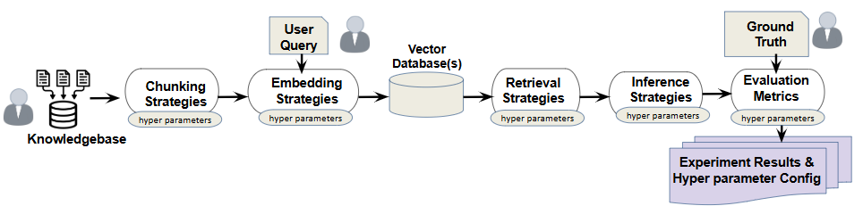

    
    
    

## What is FloTorch?

FloTorch is an innovative product poised to transform the field of Generative AI by simplifying and optimizing the decision-making process for leveraging Large Language Models (LLMs) in Retrieval Augmented Generation (RAG) systems. In today’s fast-paced digital landscape, selecting the right LLM setup is critical for achieving efficiency, accuracy, and cost-effectiveness. However, this process often involves extensive trial-and-error, significant resource expenditure, and complex comparisons of performance metrics. Our solution addresses these challenges with a streamlined, user-friendly approach.

## Why Choose FloTorch?
- **Well-Architected framework**: Focuses on five pillars of service architecture: Operational Excellence, Security, Reliability, Performance Efficiency, Cost Optimization.
- **Maximizes Efficiency**: Ensures users achieve the best performance from their chosen LLMs in less time as multiple experiments can run parallelly.
- **Eliminates Complexity**: No more manual evaluations or tedious trial-and-error processes.
- **Accelerates Selection**: Streamlines the evaluation and decision-making process.
- **Focus on Innovation**: Allows users to dedicate resources to innovation and deployment rather than experimentation.

## The FloTorch Solution

    

- **Simple & Automatic**: Simple UI, 1,000+ combinations, no human errors, no ‘It Depends’ 
- **Saves time**: Reduces experiments from months to hours
- **Encourages Experiments**: Test new LLMs / capabilities in hours with automation
- **Secure**: Your data, your AWS account, your ground truth Q&A
- **Deterministic**: Provides accuracy, performance, costs, and safety

## Demo

## Installation guide

Please refer to our [Installation guide](install.md) for the installation steps in detail.

## Usage guide

Use our [usage guide](usage_guide.md) for more details on using FloTorch.
Click [here](faq.md) for frequently asked questions.

## Contributing

For those who'd like to contribute code, see our [Contribution Guide](CONTRIBUTING.md).

## Blogs

- [Benchmarking Amazon Nova and GPT-4o models with FloTorch](https://aws.amazon.com/blogs/machine-learning/benchmarking-amazon-nova-and-gpt-4o-models-with-flotorch/)
- [Speed up RAG Experiments on AWS SageMaker with DeepSeek-R1 & FloTorch](https://www.flotorch.ai/blog/speed-up-rag-experiments-on-aws-sagemaker-with-deepseek-r1-flotorch)

